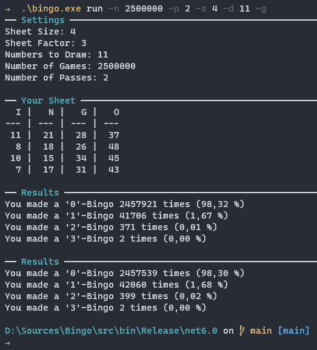

# Bingo CLI

## Introduction
During my visit at my parents this Christmas I was introduced to the game of [Bingo on the German TV Channel NDR](https://www.ndr.de/fernsehen/sendungen/bingo_die_umweltlotterie/index.html). We all had two sheets each, and none of us hit a Bingo.

This made me curious: 
* What are actually the odds at winning at this game? 
* What if we change the size of the sheet? 
* What if we draw more numbers? 
* What if we change the range of numbers for each column? 

So I wrote a program...

## The game of Bingo 
Before we get to the CLI, let's first understand the rules of the game. 

In Bingo, each participant has a _sheet_ with a 5x5 square table on it. In each table cell there are numbers. More specifically, the i-th column has random numbers from [1 + 15\*(i-1), ... , 15\*i]. So the highest number possible is 15\*5 = 75.

The host now draws 22 numbers (in an excruciatingly slow process) out of the 75 possible and announces each one directly after the individual draw. If a player finds the number on her sheet, she marks it with an X, and if she completes a row, column, or one of the diagonals, she wins and has a Bingo. Multiple Bingos on a single sheet are possible and yield higher rewards.

## Bingo.CLI
Bingo is a command line tool to simulate the game of Bingo. You run it by simply typing 
```PS
.\Bingo.exe run
````
This will run a simulation of one pass of 100.000 games of Bingo with the standard rules described above. However, the fun does not stop there. You can pass in a multitude of flags to tweak the game, e.g., like this:
```PS
.\Bingo.exe run -n 250000 -p 3 -d 27 -s 6 -f 2 -g
````
In this example, the flag
* -n sets the number of games that shall be played (default 100.000)
* -p sets the number of passes the simulation will run through (default: 1),
* -d sets the number of numbers to be drawn (default: 22)
* -s sets the size of the Bongo sheet (default: 5)
* -f sets the sheet factor (default: 3)
* -g sets whether or not a random sheet shall be generated (statistically irrelevant, but nice)

All flags are independently useable (but may restrict each other, e.g., you can't draw more numbers than are available) and combinable.

For more information, just run
```PS
.\Bingo.exe run -h
````

Here's an example of running a simulation with two passes, each of 2.5 million games, with a board size of 4 and drawing 11 numbers:



## Feedback and Contributing
All feedback welcome!
All contributions are welcome!
